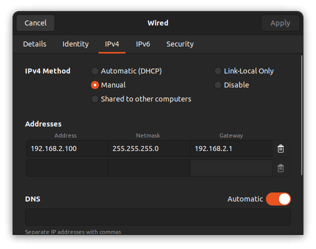
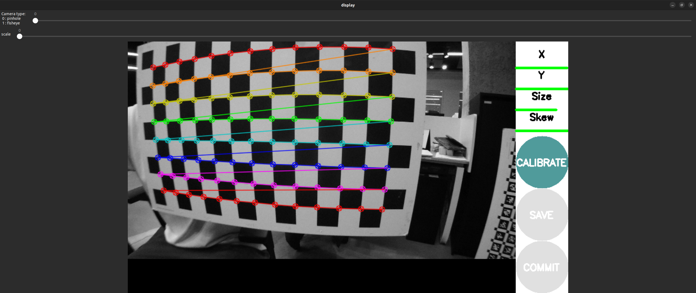
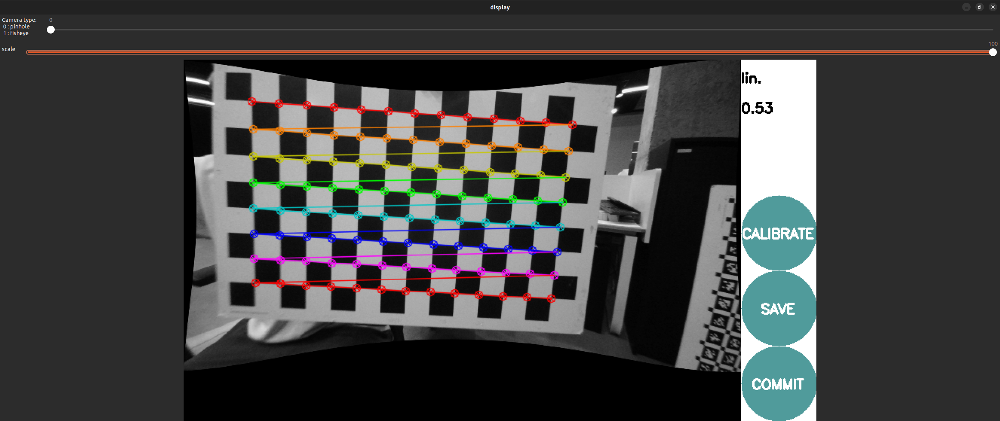
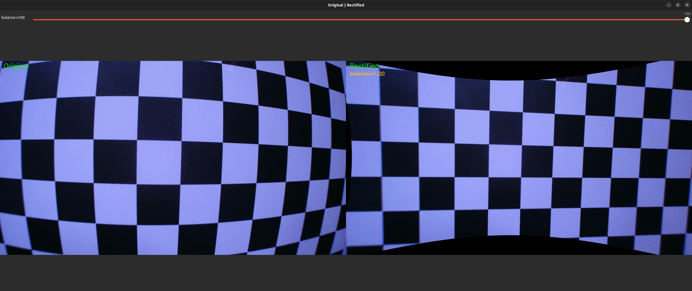

# NSL-3130AA ROS2

ROS2 Humble driver for the NanoSystems NSL-3130AA Time-of-Flight camera.

**환경**: Ubuntu 22.04 LTS / ROS2 Humble / OpenCV 4.5+

---

## 0. 클론 (최초 1회)

```bash
mkdir -p ~/colcon_ws/src
cd ~/colcon_ws/src
git clone --recurse-submodules https://github.com/zzapzzap/NSL-3130AA-ROS2.git
```

이후 모든 명령은 **`~/colcon_ws`** 를 작업 디렉토리로 사용합니다.

---

## 1. 최초 준비 (1회만)

### 1-1. USB 드라이버 & udev 규칙

```bash
sudo ~/colcon_ws/src/NSL-3130AA-ROS2/NSL3130_driver/src/roboscan_nsl3130/nsl_lib/script/install_libusb_linux.sh
```

설치 후 USB 케이블을 뽑았다 다시 꽂으면 `lsusb`에 `1fc9:0099`가 표시됩니다.

---

### 1-2. 호스트 NIC 고정 IP 설정

> **주의: 192.168.0.x 는 사내망과 충돌하므로 호스트에 절대 부여하지 마세요.**

**Ubuntu 설정 화면 (Settings → Network → Wired → IPv4):**



| 항목 | 값 |
|------|-----|
| IPv4 Method | Manual |
| Address | `192.168.2.100` |
| Netmask | `255.255.255.0` |
| Gateway | `192.168.2.1` |

> **여러 대 운용 시**: 호스트 PC마다 주소를 다르게 설정해 주세요.  
> 예) PC-A → `192.168.2.100`, PC-B → `192.168.2.101`, PC-C → `192.168.2.102` …

터미널에서 설정하실 경우 (`<NIC>`는 `ip link show`로 확인하세요):

```bash
sudo nmcli con add type ethernet ifname <NIC> con-name nsl-cam \
    ipv4.method manual \
    ipv4.addresses 192.168.2.100/24 \
    ipv4.gateway 192.168.2.1
sudo nmcli con up nsl-cam
```

---

### 1-3. 카메라 IP 변경 (공장 출하 첫 연결)

공장 기본 IP는 `192.168.0.220`이므로, **USB로 연결한 상태에서** 192.168.2.x로 변경해 주세요.  
이더넷 케이블 없이 USB만으로 진행하시면 됩니다.

```bash
# USB auto-detect (카메라 1대 연결 시)
ros2 run roboscan_nsl3130 change_camera_ip 192.168.2.220 255.255.255.0 192.168.2.1

# 카메라 여러 대를 동시에 USB 연결한 경우 시리얼 번호를 지정해 주세요
ros2 run roboscan_nsl3130 change_camera_ip 192.168.2.221 255.255.255.0 192.168.2.1 N00A5060D
```

변경 후 **카메라 전원을 껐다 켜주세요**. 이더넷 케이블을 연결한 뒤 `ping 192.168.2.220`으로 응답을 확인하세요.

> 이미 192.168.2.x로 설정된 카메라는 이 단계를 건너뛰셔도 됩니다.

---

## 2. 빌드

```bash
cd ~/colcon_ws
colcon build
source install/setup.bash
```

새 터미널을 열 때마다 `source ~/colcon_ws/install/setup.bash` 를 실행해 주세요.

---

## 3. 카메라 실행

```bash
cd ~/colcon_ws
ros2 launch roboscan_nsl3130 camera.launch.py                  # 범용(general) 프로파일 (기본)
ros2 launch roboscan_nsl3130 camera.launch.py calibration:=true  # 캘리브레이션 프로파일
```

**센서 프로파일** — 카메라 시리얼에 따라 자동 선택됩니다(드라이버 시작 로그 `[camera] sensor params: ...` / `Loaded params: path=...` 로 확인). 기기마다 진폭 편차가 커서(밝은 기기 vs 어두운 기기) **카메라별 파라미터**를 따로 둡니다.

| 우선순위 | 조건 | 사용 파일 |
|---|---|---|
| 1 | `calibration:=true` | `lidar_params_calibration.yaml` (공용, 보드용) |
| 2 | 시리얼 인식 + 파일 존재 | `calib_output/{시리얼}_params.yaml` (**기기별**) |
| 3 | 시리얼 인식 + 파일 없음 | general을 복사해 `calib_output/{시리얼}_params.yaml` **자동 생성** 후 사용 |
| 4 | 시리얼 인식 실패 | `lidar_params.yaml` (general 기본값 = zzapzzap 베이스라인) |

- 즉 **카메라를 처음 꽂으면** general 기본값으로 `{시리얼}_params.yaml` 이 자동 생성되고, 이후 rqt에서 그 기기에 맞게 다듬으면(예: 어두운 기기는 `MinAmplitude` 더 낮춤) **그 파일에 저장**되어 다음부터 자동 적용됩니다.
- 시리얼이 안 잡히면 그냥 general 기본값으로 동작합니다.
- **커버리지 핵심**: 정리 필터(Edge/Interference)는 **off**, `MinAmplitude` 는 **낮게**(2~5). 기기가 어두우면 더 낮춰도 신호 한계(≈30~40%)가 있습니다 — 노출(Integration)을 올리면 더 잡히지만 FPS가 급락하니 권장하지 않습니다.
- **Intrinsic/Extrinsic 캘리브레이션 시에는 `calibration:=true`** 로 띄우는 것을 권장합니다.

실행 시 다음이 자동으로 시작됩니다:
- **roboscan_publish_node** — 카메라 드라이버 (USB 시리얼 자동 감지)
- **rviz2** — 포인트클라우드 시각화
- **rqt_reconfigure_combo** — 파라미터 실시간 변경 (12초 후 자동 실행)

**퍼블리시 토픽:**

| 토픽 | 타입 | 설명 |
|------|------|------|
| `/camera/rgb/image_raw` | `sensor_msgs/Image` | RGB 이미지 |
| `/camera/depth/image_raw` | `sensor_msgs/Image` | 거리 이미지 |
| `/camera/point_cloud` | `sensor_msgs/PointCloud2` | XYZI 포인트클라우드 |
| `/camera/point_cloud_rgb` | `sensor_msgs/PointCloud2` | XYZRGB (캘리브레이션 완료 후 활성화) |

**frame_id**: USB 시리얼에서 자동으로 결정됩니다 → `{serial}_lidar_frame` (예: `N00A5060D_lidar_frame`)  
시리얼 감지에 실패한 경우 `lidar_frame`이 사용됩니다.

---

## 4. 캘리브레이션

캘리브레이션 파일이 없으면 SDK 내장 호모그래피로 동작합니다.  
파일이 있으면 캘리브레이션 결과 (K, D, R, t)를 바탕으로 정밀한 XYZRGB 포인트클라우드를 생성합니다.

**반드시 아래 순서로 진행해 주세요**: Intrinsic → Extrinsic

캘리브레이션 파일은 저장소 내부에 저장됩니다:

```
~/colcon_ws/src/NSL-3130AA-ROS2/calib_output/
  {camera_id}_intrinsic.yml
  {camera_id}_extrinsic.yml
```

---

### 4-1. Intrinsic 캘리브레이션

**필요 조건**: `camera.launch.py` 실행 중, 체커보드 준비

```bash
cd ~/colcon_ws
ros2 launch roboscan_nsl3130 intrinsic_calib.launch.py
```

(옵션) 체커보드 크기를 지정하는 경우 (내부 코너 수 × 정사각형 한 변 길이(m)):

```bash
ros2 launch roboscan_nsl3130 intrinsic_calib.launch.py board_size:=8x6 square_size:=0.04
```

**진행 방법:**



1. cameracalibrator GUI가 열립니다
2. 체커보드를 카메라 FOV 전체에서 다양한 각도·거리·틸트로 움직여 주세요
3. 우측 바 `X / Y / Size / Skew` 가 모두 초록색이 되거나 샘플이 40개 이상이 되면 **[CALIBRATE]** 버튼이 활성화됩니다
4. **[CALIBRATE]** 클릭
5. **[SAVE]** 클릭 → 터미널에 아래와 같이 출력되면 정상입니다



```
[intrinsic] Final RMS=2.37  K=1004.4,1005.4  D=[[ 0.054  0.032 -0.031  0.016]]
[intrinsic] Saved → .../calib_output/N00A5060D_intrinsic.yml
```

> **참고**: GUI의 CALIBRATE 결과(`D = [0.0, 0.0, 0.0, 0.0]`)는 cameracalibrator 내부 초기화 문제로 정상적으로 보이지 않습니다.  
> 실제 fisheye 캘리브레이션은 **[SAVE]** 시 터미널에서 별도로 수행되며, 위 출력의 D 값이 실제 저장되는 값입니다.

**생성 결과:**

```
~/colcon_ws/src/NSL-3130AA-ROS2/calib_output/
  {camera_id}_intrinsic.yml
```

```yaml
# 파일 내용 예시 (N00A5060D_intrinsic.yml)
camera_id: "N00A5060D"
image_width: 1920
image_height: 1080
distortion_model: "equidistant"    # Fisheye 모델
camera_matrix: !!opencv-matrix
  rows: 3  cols: 3  dt: d
  data: [ fx, 0, cx, 0, fy, cy, 0, 0, 1 ]
distortion_coefficients: !!opencv-matrix
  rows: 1  cols: 4  dt: d
  data: [ k1, k2, k3, k4 ]
```

**Rectify 결과 확인 (선택):**

캘리브레이션 후 보정 결과가 올바른지 시각적으로 확인하려면 debug 모드를 사용하세요.

```bash
ros2 launch roboscan_nsl3130 intrinsic_calib.launch.py debug:=true
```



Original(원본) | Rectified(보정) 화면이 나란히 표시됩니다.  
상단 `balance` 트랙바로 크롭 비율을 실시간으로 조정할 수 있습니다 (0 = 검은 테두리 제거, 100 = 전체 픽셀 유지).

> 보정 결과가 이상해 보인다면 샘플이 부족하거나 편향된 것입니다. 다시 캘리브레이션을 수행해 주세요.

---

### 4-2. Extrinsic 캘리브레이션

**필요 조건**: `camera.launch.py` 실행 중, Intrinsic 완료 (`{camera_id}_intrinsic.yml` 존재)

> `{camera_id}_intrinsic.yml` 파일이 없으면 실행이 즉시 중단됩니다.

```bash
cd ~/colcon_ws
ros2 launch roboscan_nsl3130 extrinsic_calib.launch.py
```

**변환 방향**: LiDAR 좌표를 카메라 좌표로 보내는 외부 파라미터를 구합니다 → `x_cam = R · x_lidar + t`

**터미널 키**: `s`=프레임 저장  `c`=캘리브레이션  `r`=초기화  `q`=종료

**한 프레임 저장(`s`) 절차** — LiDAR(Amplitude) → RGB 순서로 **직접 Ctrl+클릭** 합니다:

1. 보드를 카메라와 LiDAR FOV가 겹치는 위치에 고정합니다.
2. 터미널에서 **`s`** → **Amplitude(LiDAR) 창**이 열립니다.
   - (선택) **`Alt`+드래그**(또는 **우클릭 드래그**)로 **RANSAC을 돌릴 영역**을 직접 지정합니다(주황 점선). 지정하지 않으면 찍은 점들의 bbox가 자동 사용됩니다.
   - 보드 위의 점 `N`개(기본 5개)를 **`Ctrl`+클릭** 으로 찍습니다. (그냥 클릭은 무시됩니다 — 오클릭 방지)
   - **`Enter`** → 지정 영역(또는 점 bbox)에 **RANSAC 평면**을 맞추고, 각 점의 시선(ray)을 그 평면에 투영해 **3D 좌표를 보정**합니다. (raw depth의 노이즈 대신 평면 기하를 사용)
   - 창 제목에 품질이 표시됩니다: `inliers=…/…  rms=…mm  max_corr=…mm`. 만족하면 **`Enter` 한 번 더** → 확정. 다시 찍으려면 **`r`**.
3. 이어서 **RGB(카메라) 창**이 열립니다.
   - **같은 점들을 같은 순서**로 `Ctrl`+클릭하고 **`Enter`**.
4. **두 창 모두 정확히 `N`개**를 찍어야 한 세트가 저장됩니다. 개수가 어긋나면 그 프레임은 **저장되지 않습니다**(LiDAR만 찍고 RGB를 취소해도 LiDAR도 저장 안 됨).
5. 위치를 바꿔 가며 **2~4를 5회 이상** 반복합니다.
6. **`c`** → solvePnP 로 `R, t` 계산·저장. 콘솔에 **R 행렬·t 벡터·RMSE·LiDAR 기준 카메라 위치**가 출력됩니다:
   ```
   [c] ───── Extrinsic result  (x_cam = R · x_lidar + t) ─────
   [c] inliers=18/20   RMSE=1.83 px
   [c] R =
    [[ ... ]]
   [c] t = [tx, ty, tz]  (metres)
   [c] camera origin in LiDAR frame = [ ... ]  (m)
   ```

> **표시/검증**: 두 창 모두 찍은 점에 **번호 별표(★)와 연결선**이 그려져 LiDAR↔RGB 대응을 바로 확인할 수 있습니다. 프레임마다 `extrinsic_{camera_id}/debug_{camera_id}/NN.png` 에 **Amplitude | RGB 나란히 비교 이미지**가 저장됩니다.

> **Amplitude 대비**: 포화 픽셀(반사·간섭 컬럼)을 제외하고 stretch 하므로 보드가 선명하게 보입니다. 그래도 안 보이면 보드 각도/거리를 조정하세요.

> **RANSAC 품질 기준(권장)**: `inliers 비율 ≥ 80%`, `rms ≤ 10mm` 정도면 양호합니다. 비율이 낮거나 rms가 크면 평면이 아닌 배경이 섞인 것이니, 보드만 포함되도록 점을 보드 안쪽에 찍고 다시 시도하세요.

**생성 결과:**

```
~/colcon_ws/src/NSL-3130AA-ROS2/calib_output/
  {camera_id}_extrinsic.yml
```

```yaml
# 파일 내용 예시 (N00A5060D_extrinsic.yml)
# 변환 방향: x_cam = R · x_lidar + t  (LiDAR 좌표 → 카메라 좌표)
camera_id: "N00A5060D"
R: !!opencv-matrix               # 3×3 회전 행렬
  rows: 3  cols: 3  dt: d
  data: [ r00, r01, r02,
          r10, r11, r12,
          r20, r21, r22 ]
t: !!opencv-matrix               # 3×1 평행이동 벡터 (단위: m)
  rows: 3  cols: 1  dt: d
  data: [ tx, ty, tz ]
```

저장 후 **드라이버를 재시작**하시면 다음이 활성화됩니다:

- `/camera/point_cloud_rgb` — 캘리브레이션 결과 기반 XYZRGB 포인트클라우드
- **TF**: `camera.launch.py` 가 extrinsic을 읽어 `{camera_id}_lidar_frame → {camera_id}_camera_frame` 정적 TF를 publish합니다. RViz의 TF 디스플레이나 아래 명령으로 확인할 수 있습니다:

```bash
ros2 run tf2_ros tf2_echo {camera_id}_lidar_frame {camera_id}_camera_frame
```

> TF publish를 끄려면 `ros2 launch roboscan_nsl3130 camera.launch.py use_extrinsic_tf:=false` 로 실행하세요.  
> extrinsic 파일이 아직 없으면 경고만 남기고 넘어갑니다(런치는 정상 동작).

---

## 5. 파라미터 설정

초기값 파일(위 3-섹션 표의 우선순위로 선택됨):

- `calib_output/{시리얼}_params.yaml` — **기기별** (general 첫 사용 시 자동 생성, 권장)
- `lidar_params.yaml` — **general** 기본값(베이스라인)
- `lidar_params_calibration.yaml` — **calibration** (`calibration:=true`)

실행 중 rqt_reconfigure_combo 에서 실시간 변경하면 **현재 사용 중인 파일**(보통 그 기기의 `{시리얼}_params.yaml`)에 저장되어, 기기마다 세팅이 따로 유지됩니다. 드라이버는 `NSL_PARAMS_FILE` 환경변수가 가리키는 파일을 읽고, `camera.launch.py` 가 시리얼·`calibration` 인자에 따라 자동 설정합니다.

| 키 | general | calibration | 설명 |
|----|--------|--------|------|
| `IP Addr` | `192.168.2.220` | `192.168.2.220` | 카메라 IP |
| `ImageType` | `RGB_DISTANCE_AMPLITUDE` | `RGB_DISTANCE_AMPLITUDE` | 이미지 모드 |
| `LensType` | `LENS_SF` | `LENS_SF` | 렌즈 종류 |
| `MaxDistance` | `12500` | `12500` | 최대 거리 (mm) |
| `MinAmplitude` | `5` | `35` | **최소 진폭** — 낮을수록 약한 반사까지 살려 더 많이 보임(노이즈↑) |
| `EdgeFilterThreshold` | `0` | `0` | 깊이 경계 플라잉픽셀 제거(0=off) — 켜면 점이 많이 깎임 |
| `InterferenceDetectionLimit` | `0` | `0` | 멀티패스/간섭 제거(0=off) — 켜면 점이 많이 깎임 |
| `LidarAngle` | `0` | `0` | 포인트클라우드 회전 오프셋 (도) |

> **커버리지의 핵심**: 정리 필터(Edge/Interference)를 켜면 포인트가 크게 줄어듭니다(실측 7.8%까지). 장면 전체를 보려면 **둘 다 0(off)** 으로 두고 `MinAmplitude` 를 낮추세요(5~20 권장, 낮을수록 더 많이/노이즈도 많이).  
> 노출(`IntegrationTime*`)을 너무 키우면 센서 프레임이 멈출 수 있으니 주의하세요(기본 350/700/80 권장).  
> 값은 rqt_reconfigure에서 실시간으로 바꿀 수 있고, 저장 시 현재 프로파일 파일에 반영됩니다.

---

## Phase Wrapping Avoidance and Correction


## Average FPS

```
최대 20 fps
```
